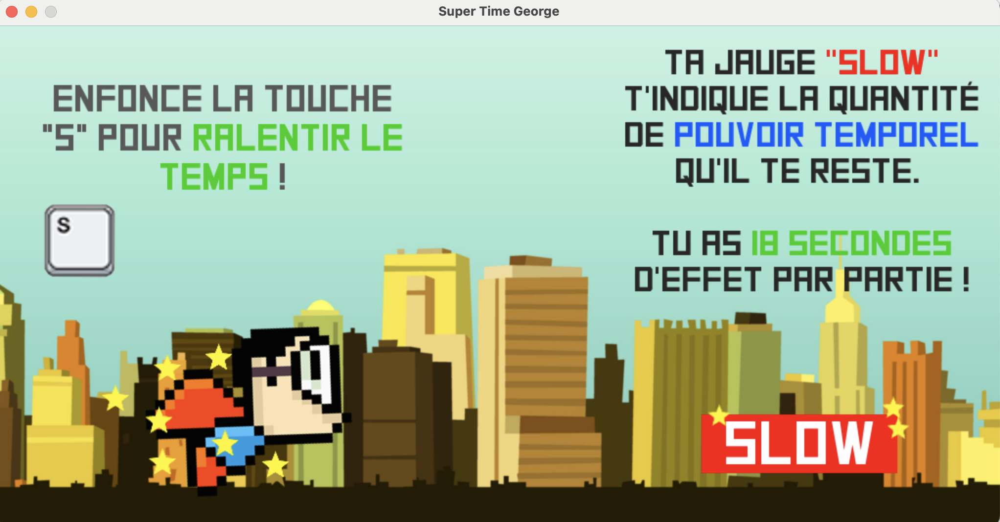
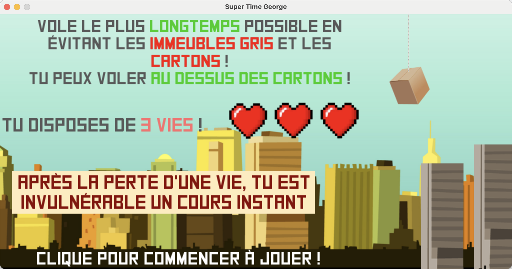
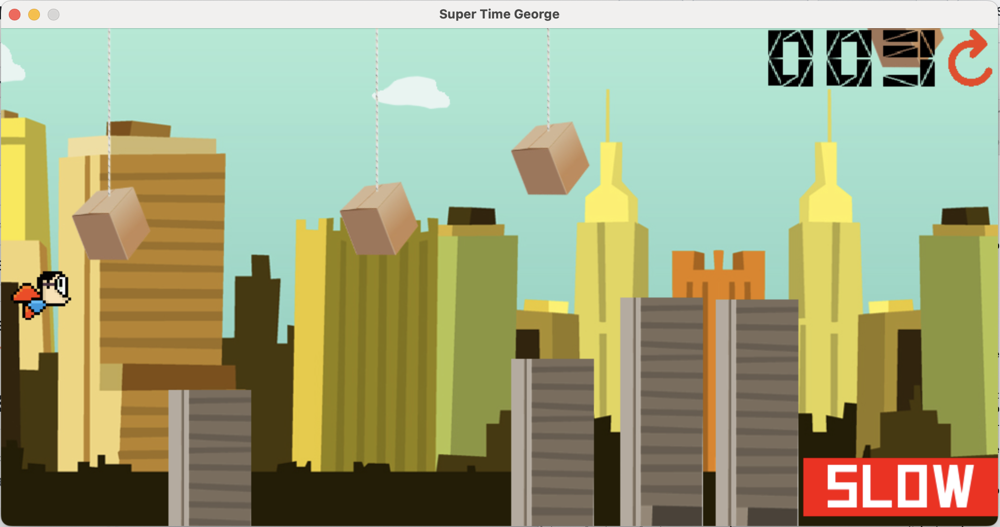
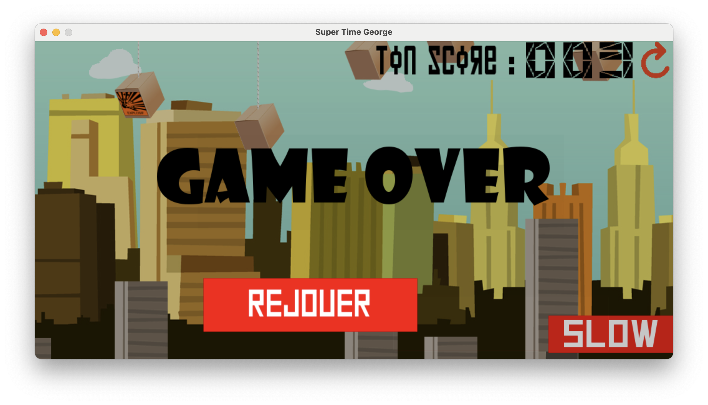

# SuperTimeGeorges

> This codebase dates back to 2015, when I was studying fundamental physics. My classmates’ enthusiasm for the game motivated me to enroll in a computer science bachelor’s program.

```bash
python -m pip install pygame==2.6.0
cd src
python main.py
```







